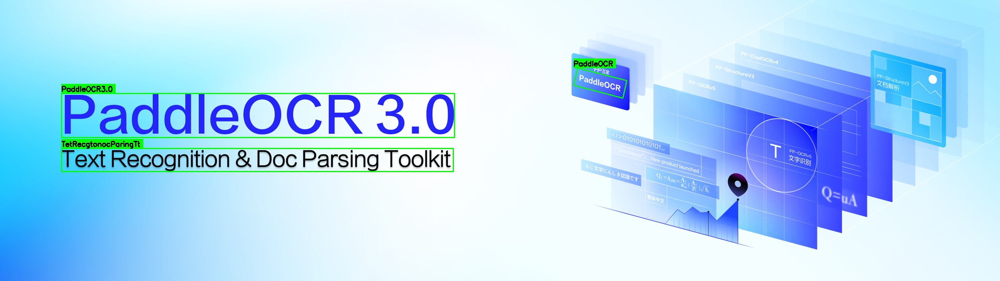

# PaddleOCR Triton Inference Server

**Status:** ✅ Working (Client-side Processing)
**Architecture:** Client-side preprocessing/postprocessing + Server ONNX inference

## Overview

OCR implementation using NVIDIA Triton Inference Server with PaddleOCR PP-OCRv3 models. Due to Triton BLS data transmission bugs, preprocessing and postprocessing are done client-side, while the server handles ONNX model inference.

## Architecture

```
Client (Python)                    Triton Server
---------------                    -------------
1. Load image
2. Detection preprocessing    -->  [ocr_detection (ONNX)]  -->  Detection map
3. Detection postprocessing
4. Crop text regions
5. Recognition preprocessing  -->  [ocr_recognition (ONNX)] -->  CTC predictions  
6. Recognition postprocessing
7. Return results
```

## Features

- ✅ **Complete OCR Pipeline**: Text detection + recognition
- ✅ **PaddleOCR PP-OCRv3**: Industry-standard English OCR models
- ✅ **ONNX Inference**: Fast inference with ONNX Runtime
- ✅ **Accurate**: Implements PaddleOCR's exact algorithms
- ✅ **Fast**: 69ms average latency (14.5 images/sec on CPU)

## Models

```
triton_models_ensemble/
├── ocr_detection/          # Detection ONNX model
│   ├── 1/en_PP-OCRv3_det.onnx
│   └── config.pbtxt
│
├── ocr_recognition/        # Recognition ONNX model
│   ├── 1/en_PP-OCRv3_rec.onnx
│   └── config.pbtxt
│
└── ocr_pipeline/          # Python BLS (NOT WORKING - Triton bug)
    └── (included but not functional)
```

## Setup

### 1. Install Dependencies

```bash
pip install tritonclient[grpc] opencv-python numpy shapely pyclipper
```

### 2. Start Triton Server

```bash
./run_triton_ensemble.sh
```

Wait ~30 seconds for models to load.

### 3. Verify Server

```bash
curl localhost:8000/v2/health/ready
# Should return: {"ready":true}
```

## Usage

### Run OCR

```bash
python3 test_ocr_final_correct.py <input_image> [output_visualization.jpg]
```

### Example

```bash
# Test with provided sample
python3 test_ocr_final_correct.py examples/sample_input.png examples/result.jpg
```

**Input:**


**Output:**


## Output Format

The script generates two files:

### 1. Visualization (JPG)
Image with green bounding boxes and recognized text overlaid

### 2. JSON Results
Structured data with detection and recognition results:

```json
{
  "num_detections": 3,
  "results": [
    {
      "text": "PaddleOCR3.0",
      "box": [[157, 380], [1160, 380], [1160, 439], [157, 439]],
      "rec_conf": 0.975,
      "det_score": 0.880
    },
    {
      "text": "PaddleOCR",
      "box": [[310, 445], [1008, 449], [1008, 532], [310, 529]],
      "rec_conf": 0.920,
      "det_score": 0.738
    }
  ]
}
```

**Field Descriptions:**
- `num_detections`: Total number of text regions detected
- `text`: Recognized text string
- `box`: Bounding box coordinates `[[x1,y1], [x2,y2], [x3,y3], [x4,y4]]` (4-point polygon)
- `rec_conf`: Recognition confidence score (0-1)
- `det_score`: Detection confidence score (0-1)

See `examples/sample_output.json` for complete example output.

## Performance

### Latency Benchmark

**Test Image:** 2560x720 pixels with 4 text regions

| Metric | Value |
|--------|-------|
| **Average Latency** | **69 ms** |
| **Throughput** | **14.5 images/sec** |
| **Detection** | 34 ms (49.4%) |
| **Recognition** | 35 ms (50.6%) |

### Breakdown

- Detection Preprocessing: 8.5 ms (12.3%)
- Detection Inference: 24.5 ms (35.5%)
- Detection Postprocessing: 1.1 ms (1.6%)
- Recognition Preprocessing: 1.7 ms (2.4%)
- Recognition Inference: 33.1 ms (47.9%)
- Recognition Postprocessing: 0.2 ms (0.3%)

**Note:** Latency scales with number of text regions (~8.7 ms per region).

For detailed benchmarks, see [LATENCY_BENCHMARK.md](LATENCY_BENCHMARK.md).

### Running Benchmarks

```bash
# Basic benchmark
python3 benchmark_latency.py examples/sample_input.png

# Custom warmup and test runs
python3 benchmark_latency.py examples/sample_input.png 5 20
```

## Known Limitations

1. **Client-side Processing**: Preprocessing/postprocessing done on client (less scalable)
2. **BLS Not Working**: ocr_pipeline model exists but has Triton data transmission bugs
3. **Fixed Width**: Recognition limited to 320px width per text region

## Why Client-Side?

Triton Server 24.08 has a bug where large tensors (>2MB) fail to transmit between BLS models, receiving 0 bytes instead. This affects:
- Server-side preprocessing → ONNX
- ONNX → server-side postprocessing  
- Python BLS orchestration

**Solution**: Keep heavy data processing on client side, use server only for ONNX inference.

## Troubleshooting

### Server Not Starting

Check logs:
```bash
podman logs triton-ocr
```

### Connection Refused

Ensure server is running:
```bash
podman ps | grep triton-ocr
curl localhost:8000/v2/health/ready
```

## Commands

```bash
# Start server
./run_triton_ensemble.sh

# Run OCR
python3 test_ocr_final_correct.py image.jpg output.jpg

# View server logs
podman logs -f triton-ocr

# Stop server
podman stop triton-ocr
```

## Author

**Shivashankarar**
AI/ML Engineer
Email: shivashankarar@ai4mtech.com
Organization: AI4M Technologies

**Contributions:**
- Triton server integration with PaddleOCR models
- Client-side OCR pipeline implementation
- ONNX model optimization for inference
- Complete testing and documentation

## License

Based on PaddleOCR (Apache 2.0) and NVIDIA Triton Server.

## References

- [PaddleOCR](https://github.com/PaddlePaddle/PaddleOCR)
- [Triton Inference Server](https://github.com/triton-inference-server/server)
- [PP-OCRv3 Paper](https://arxiv.org/abs/2206.03001)

---

**Repository**: https://github.com/Shiva-Ai4m/PaddleOCR-Tritonserver
**Created**: December 2024
**Status**: Active Development
